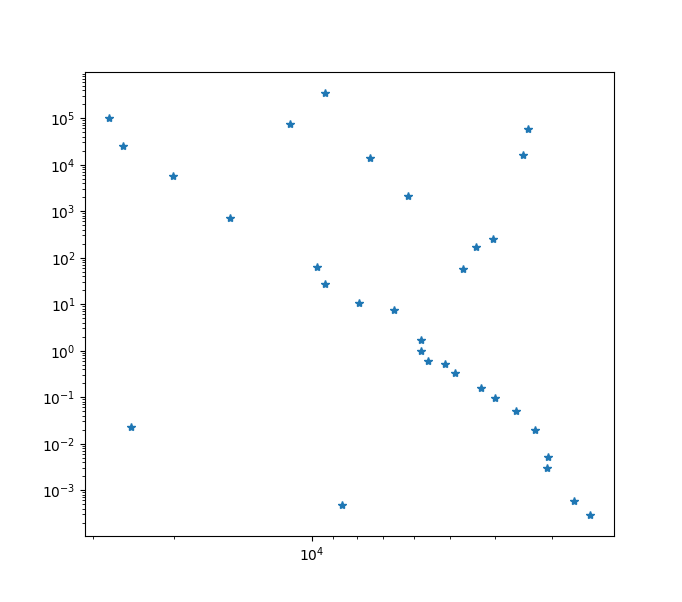

# Diagrama de Hertzsprung-Russell (HR) em Python

Este código em Python cria uma reprodução do "Diagrama de Hertzsprung-Russell", que representa a relação entre as temperaturas e luminosidades de um conjunto de estrelas. Além disso, realiza cálculos estatísticos, como médias, variâncias e coeficiente de correlação linear, proporcionando endendimento sobre as características e distribuição dessas estrelas.

## Principais Funcionalidades

1. **Visualização Gráfica:**
   - Utiliza a biblioteca `matplotlib` para plotar um gráfico que ilustra a distribuição das estrelas no Diagrama de Hertzsprung-Russell.

2. **Análise Estatística:**
   - Calcula a média e a variância das temperaturas e luminosidades.
   - Determina o coeficiente de correlação linear, explorando a relação entre essas variáveis.

3. **Interpretação dos Dados:**
   - Fornece estatísticas descritivas sobre as temperaturas e luminosidades médias, variâncias e a força da correlação linear.

## Diagrama de Hertzsprung-Russell (HR)

O Diagrama HR é uma ferramenta crucial na astrofísica, representando a relação entre a luminosidade e a temperatura das estrelas. No contexto deste código, o Diagrama HR permite visualizar padrões semelhantes aos encontrados no gráfico gerado, ajudando a compreender a distribuição estelar e explorar características específicas das estrelas, como sua posição na sequência principal, gigantes ou anãs brancas.

## Como Utilizar o Código

1. **Pré-requisitos:**
   - Certifique-se de ter o Python instalado em seu ambiente.

2. **Execução:**
   - Execute o código em um ambiente Python.
   - Observará um gráfico gerado com as temperaturas e luminosidades das estrelas.
   - A saída no console fornecerá estatísticas importantes sobre os dados.

3. **Exploração:**
   - Analise as estatísticas para compreender a tendência geral das temperaturas e luminosidades.
   - Interpretação do gráfico para identificar possíveis padrões e relações.

---

## Descrição do Código

### Bloco 1: Importação de Bibliotecas

```python
import matplotlib.pyplot as plt
import math
```


- Importa as bibliotecas necessárias, como `matplotlib.pyplot` para a plotagem do gráfico e `math` para cálculos matemáticos.

### Bloco 2: Definição dos Dados

```python
TEMP_LIST = [ ... ]  # Lista de temperaturas
LUM_LIST = [ ... ]   # Lista de luminosidades
```


- Define duas listas de dados, `TEMP_LIST` e `LUM_LIST`, contendo as temperaturas e luminosidades das estrelas.

### Bloco 3: Função Principal

```python
def main():
    ...
```


- Define a função principal do programa.

### Bloco 4: Plotagem do Gráfico

```python
plt.yscale("log")
plt.xscale("log")
plt.plot(TEMP_LIST, LUM_LIST, '*' )
plt.show()
```


- Configura a escala logarítmica nos eixos x e y.
- Plota um gráfico de dispersão usando `TEMP_LIST` e `LUM_LIST`.

### Bloco 5: Cálculos Estatísticos

```python
temp_mean = sum(TEMP_LIST) / len(TEMP_LIST)
lum_mean = sum(LUM_LIST) / len(LUM_LIST)
var_temp = 0 
var_lum = 0
```

- Calcula a média das temperaturas e luminosidades.
- Inicializa as variáveis para cálculos posteriores de variância.

### Bloco 6: Cálculo da Variância

```python
for i in range(0, len(TEMP_LIST)):
    var_temp += (TEMP_LIST[i] - temp_mean) ** 2
var_temp = var_temp / len(TEMP_LIST)

for i in range(0, len(LUM_LIST)):
    var_lum += (LUM_LIST[i] - lum_mean) ** 2
var_lum = var_lum / len(LUM_LIST)
```

- Calcula a variância das temperaturas e luminosidades.

### Bloco 7: Exibição das Estatísticas na Tela

```python
print(f"temperatura média = {temp_mean}")
print(f"luminosidade média = {lum_mean}")
print("")
print(f"variância da temperatura  = {var_temp}")
print(f"variância da luminosidade = {var_lum}")
```

- Exibe na tela a temperatura média, luminosidade média, variância da temperatura e variância da luminosidade.

### Bloco 8: Cálculo do Coeficiente de Correlação Linear

```python
num = 0
for i in range(0, len(LUM_LIST)):
    num += (LUM_LIST[i] - lum_mean) * (TEMP_LIST[i] - temp_mean)

den = math.sqrt(var_temp * len(TEMP_LIST)) * math.sqrt(var_lum * len(LUM_LIST))
coeff = num / den
print(f"coeficiente de correlação linear = {coeff}")
```

- Calcula o coeficiente de correlação linear (Pearson) entre temperaturas e luminosidades.

### Bloco 9: Chamada da Função Principal

```python
main()
```

- Chama a função principal para executar o programa.

---

## Plot do diagrama HR



---

## Diagrama de Hertzsprung-Russell (HR)


<br>

### O que é o Diagrama HR?

O Diagrama de Hertzsprung-Russell é uma ferramenta gráfica que relaciona luminosidade e temperatura das estrelas. Ele é fundamental na astrofísica para compreender a evolução e classificação estelar.

### Componentes Principais do Diagrama HR

1. **Sequência Principal:**
   - Região onde a maioria das estrelas, incluindo o Sol, reside. Representa a fusão de hidrogênio em hélio.

2. **Gigantes e Supergigantes:**
   - Estrelas maiores e mais frias que se encontram acima da sequência principal.

3. **Anãs Brancas:**
   - Estágio final da evolução estelar para estrelas como o Sol.

### Relação com o Código

O código gera um gráfico que, em escala logarítmica, representa a relação entre temperaturas e luminosidades das estrelas. Isso permite visualizar padrões semelhantes aos encontrados no Diagrama HR. As estatísticas calculadas, como médias e coeficiente de correlação, fornece entendimento sobre as relações entre essas variáveis, contribuindo para a compreensão da distribuição estelar.

---

## Autor <br>
**Nome:** [ Lauro Bonometti ] <br>
**Email:** [ lauro.f.bonometti@gmail.com ]
<br>

## Licença <br>
Este código é disponibilizado sob a Licença MIT. Consulte o arquivo [LICENSE](LICENSE) para obter detalhes.
